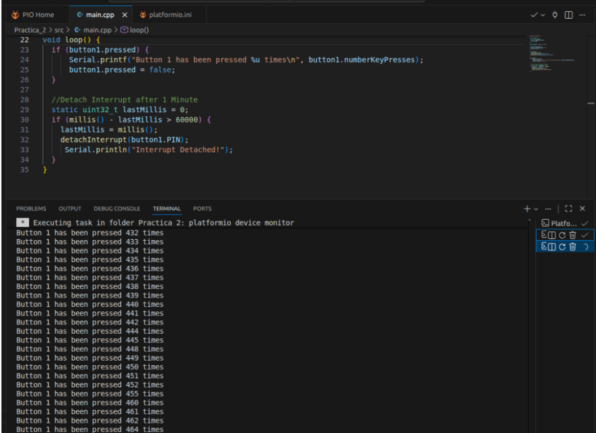
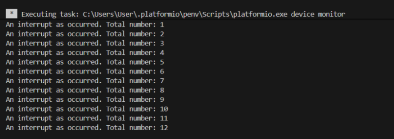
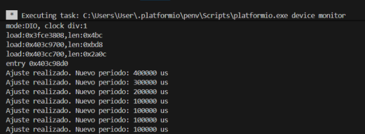
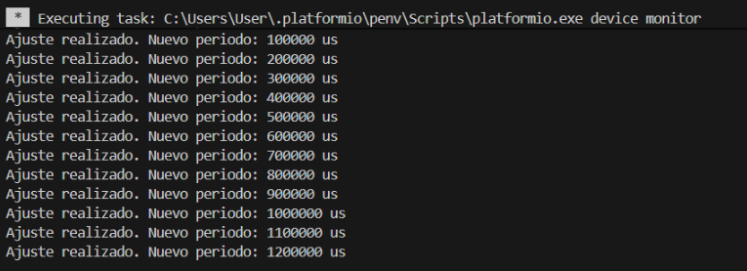

# Pràctica 2: Interrupcions

Alumnes: **Martí Cabanes i Adriana Bosch**

## Objectiu

L’objectiu d’aquesta pràctica és entendre el funcionament de les interrupcions en una placa ESP32. S’han treballat interrupcions per GPIO, provocades per la pulsació d’un botó, i interrupcions per timer, generades per un temporitzador intern.

A més, s’ha afegit un apartat complementari proposat: "Un codigo que controle un led y dos pulsadores utilizando interrupciones de un timer de forma que el led parpadee a una fecurncia inicial y si pulsamos a un pulsador la frecuencia de parpadeo suba y si pulsamos a otro pulsador dicha frecuencia baje ; grrantiza de que el pulsador los pulsadores que se deben de leer en el timer se filtran para evitar rebotes"

# Apartat A: Interrupció per GPIO

## Objectiu de l’apartat

En aquest apartat es treballa amb una interrupció externa generada per un botó connectat a un pin GPIO de l’ESP32.

Quan es prem el botó, el pin canvia d’estat i es genera una interrupció. Aquesta interrupció executa una rutina especial anomenada ISR, que incrementa un comptador de pulsacions.

## Codi

```cpp
#include <Arduino.h>

struct Button { 
  const uint8_t PIN; 
  volatile uint32_t numberKeyPresses; 
  volatile bool pressed; 
}; 

Button button1 = {18, 0, false}; 

void IRAM_ATTR isr() { 
  button1.numberKeyPresses += 1; 
  button1.pressed = true; 
} 

void setup() { 
  Serial.begin(115200); 
  pinMode(button1.PIN, INPUT_PULLUP); 
  attachInterrupt(button1.PIN, isr, FALLING); 
} 

void loop() { 
  if (button1.pressed) { 
    Serial.printf("Button 1 has been pressed %u times\n", button1.numberKeyPresses); 
    button1.pressed = false; 
  } 

  static uint32_t lastMillis = 0; 
  if (millis() - lastMillis > 60000) { 
    lastMillis = millis(); 
    detachInterrupt(button1.PIN); 
    Serial.println("Interrupt Detached!"); 
  } 
}
```

## Funcionament

En aquest apartat hem utilitzat un pulsador connectat al pin `18` de l’ESP32. La idea és que, cada vegada que premem el botó, no sigui el programa principal qui estigui comprovant constantment si s’ha premut o no, sinó que sigui la pròpia interrupció qui detecti aquest canvi.

Quan el botó es prem, el pin passa de nivell alt a nivell baix, i això fa que s’activi la interrupció configurada amb `attachInterrupt()`. En aquell moment s’executa la funció `isr()`, que simplement suma una pulsació al comptador i activa una variable per indicar que el botó ha estat premut.

Després, dins del `loop()`, el programa comprova aquesta variable i mostra pel monitor sèrie quantes vegades s’ha premut el botó. D’aquesta manera, la interrupció només fa una tasca molt curta i la resta del treball es fa dins del programa principal.

Finalment, després d’un minut, el programa desactiva la interrupció amb `detachInterrupt()`, de manera que les pulsacions del botó ja no es continuen comptant.

## Sortida esperada pel monitor sèrie



---

# Apartat B: Interrupció per timer

## Objectiu de l’apartat

En aquest apartat s’utilitza un temporitzador intern de l’ESP32 per generar interrupcions periòdiques. A diferència de l’apartat A, aquí la interrupció no depèn d’un esdeveniment extern, sinó d’un comptador intern del microcontrolador.

Aquest apartat correspon a la **Pràctica B: interrupció per timer** indicada al document de la pràctica.

## Codi

```cpp
#include <Arduino.h>

volatile int interruptCounter = 0;
int totalInterruptCounter = 0;

hw_timer_t *timer = NULL;
portMUX_TYPE timerMux = portMUX_INITIALIZER_UNLOCKED;

void IRAM_ATTR onTimer() {
  portENTER_CRITICAL_ISR(&timerMux);
  interruptCounter++;
  portEXIT_CRITICAL_ISR(&timerMux);
}

void setup() {
  Serial.begin(115200);

  timer = timerBegin(0, 80, true);
  timerAttachInterrupt(timer, &onTimer, true);
  timerAlarmWrite(timer, 1000000, true);
  timerAlarmEnable(timer);

  Serial.println("Timer iniciat");
}

void loop() {
  if (interruptCounter > 0) {

    portENTER_CRITICAL(&timerMux);
    interruptCounter--;
    portEXIT_CRITICAL(&timerMux);

    totalInterruptCounter++;

    Serial.print("An interrupt has occurred. Total number: ");
    Serial.println(totalInterruptCounter);
  }
}
```

## Funcionament

En aquest apartat hem utilitzat un temporitzador intern de l’ESP32. A diferència de l’apartat anterior, aquí la interrupció no depèn d’un botó o d’un element extern, sinó que es genera automàticament cada cert temps.

El timer es configura perquè compti en microsegons i generi una interrupció cada segon. Cada vegada que es produeix aquesta interrupció, s’executa la funció `onTimer()`, que incrementa un comptador.

Després, dins del `loop()`, el programa comprova si s’ha produït alguna interrupció. Si és així, actualitza el nombre total d’interrupcions i ho mostra pel monitor sèrie.

Això ens permet veure com el microcontrolador pot executar accions periòdiques sense haver d’utilitzar `delay()`, ja que el timer funciona de manera independent al flux principal del programa.

## Sortida esperada pel monitor sèrie



---

# Apartat C: Programa generat amb ChatGPT

## Objectiu de l’apartat

A més dels apartats A i B del document de la pràctica, s’ha realitzat un apartat complementari proposat pel professor. En aquest apartat s’ha utilitzat ChatGPT per generar un programa per a ESP32 en l’entorn PlatformIO.

El programa controla un LED i dos pulsadors. El LED parpelleja amb una freqüència inicial definida per un timer. Quan es prem un dels pulsadors, la freqüència de parpelleig augmenta. Quan es prem l’altre pulsador, la freqüència disminueix.

També s’ha incorporat un filtre de rebots per evitar que una sola pulsació sigui detectada diverses vegades.

## Codi

```cpp
#include <Arduino.h>

// Pins utilitzats
const int LED_PIN = 2;
const int PIN_SUBIR = 47;
const int PIN_BAJAR = 48;

// Període inicial del parpelleig en microsegons
volatile uint32_t periodoActual = 500000;

// Flags modificats per les interrupcions
volatile bool flagTimer = false;
volatile bool flagSubir = false;
volatile bool flagBajar = false;

// Variables del timer
hw_timer_t *timer = NULL;
portMUX_TYPE timerMux = portMUX_INITIALIZER_UNLOCKED;

// ISR del timer
void IRAM_ATTR onTimer() {
  flagTimer = true;
}

// ISR del pulsador per augmentar freqüència
void IRAM_ATTR isrSubir() {
  flagSubir = true;
}

// ISR del pulsador per disminuir freqüència
void IRAM_ATTR isrBajar() {
  flagBajar = true;
}

void setup() {
  Serial.begin(115200);

  pinMode(LED_PIN, OUTPUT);
  pinMode(PIN_SUBIR, INPUT_PULLUP);
  pinMode(PIN_BAJAR, INPUT_PULLUP);

  attachInterrupt(PIN_SUBIR, isrSubir, FALLING);
  attachInterrupt(PIN_BAJAR, isrBajar, FALLING);

  // Configuració del timer
  // 80 MHz / 80 = 1 tick cada microsegon
  timer = timerBegin(0, 80, true);
  timerAttachInterrupt(timer, &onTimer, true);
  timerAlarmWrite(timer, periodoActual, true);
  timerAlarmEnable(timer);

  Serial.println("Programa iniciat");
  Serial.println("LED amb frequencia variable mitjancant dos pulsadors");
}

void loop() {
  // Canvi d'estat del LED quan el timer genera una interrupció
  if (flagTimer) {
    flagTimer = false;
    digitalWrite(LED_PIN, !digitalRead(LED_PIN));
  }

  // Debounce dels pulsadors
  static uint32_t lastDebounceTime = 0;
  uint32_t currentTime = millis();

  if (currentTime - lastDebounceTime > 200) {
    if (flagSubir || flagBajar) {

      portENTER_CRITICAL(&timerMux);

      if (flagSubir && periodoActual > 100000) {
        periodoActual -= 100000;
      }

      if (flagBajar && periodoActual < 2000000) {
        periodoActual += 100000;
      }

      timerAlarmWrite(timer, periodoActual, true);

      flagSubir = false;
      flagBajar = false;

      portEXIT_CRITICAL(&timerMux);

      Serial.print("Nou periode del LED: ");
      Serial.print(periodoActual);
      Serial.println(" us");

      lastDebounceTime = currentTime;
    }
  }
}
```

## Funcionament

En aquest apartat hem combinat les dues idees treballades anteriorment: les interrupcions per botó i les interrupcions per timer.

El programa controla un LED que parpelleja amb una freqüència inicial. Aquest parpelleig no es fa amb `delay()`, sinó amb un timer intern de l’ESP32. Quan el timer arriba al temps configurat, s’activa una bandera i després, dins del `loop()`, es canvia l’estat del LED.

També hem afegit dos pulsadors. Un serveix per fer que el LED parpellegi més ràpid i l’altre perquè parpellegi més lent. Quan es prem un pulsador, la interrupció no canvia directament la freqüència, sinó que només activa una variable indicant que s’ha premut. Després, el `loop()` s’encarrega de modificar el període del timer.

A més, s’ha afegit un petit filtre de rebots. Això és necessari perquè els pulsadors mecànics poden generar diverses lectures molt ràpides encara que només s’hagin premut una vegada. Amb aquest filtre, el programa ignora pulsacions massa seguides i evita que la freqüència canviï més d’un cop per una sola pulsació.

En resum, aquest apartat serveix per veure com es poden combinar interrupcions de diferents tipus per controlar el comportament d’un LED de manera més flexible.

## Sortida esperada pel monitor sèrie




---

## Conclusions

En aquesta pràctica s’ha après el funcionament de les interrupcions en una placa ESP32. En primer lloc, s’ha utilitzat una interrupció per GPIO per detectar la pulsació d’un botó sense haver de comprovar constantment el seu estat dins del `loop()`.

En segon lloc, s’ha utilitzat una interrupció per timer per generar esdeveniments periòdics sense utilitzar `delay()`. Això permet que el programa continuï executant altres tasques mentre el temporitzador funciona de manera independent.

Finalment, amb l’apartat complementari generat amb ChatGPT, s’han combinat les interrupcions per GPIO i per timer per controlar la freqüència de parpelleig d’un LED mitjançant dos pulsadors. També s’ha implementat un sistema de filtratge de rebots per evitar lectures errònies dels botons.